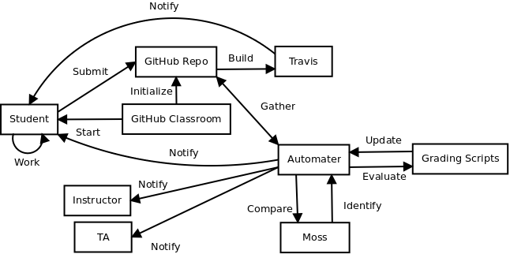

# general
A repo to contain general information about the internship &amp; project structure  
  

Article on using GitHub Classroom & automation:  
https://github.com/blog/2324-real-time-feedback-for-students-using-continuous-integration-tools  

Intro resource for CI:  
http://python-guide-pt-br.readthedocs.io/en/latest/scenarios/ci/  

classwerk, a Python tool for facilitating GitHub as assignment management platform:  
https://github.com/keshavdv/classwerk  

classroom, a Ruby on Rails application to create classrooms (more involved process):  
(This looks like it's the source for the actual GitHub Classroom)  
https://github.com/education/classroom  

Resources describing the process of introducing community support for a language (such as MIPS) to Travis:  
https://github.com/travis-ci/travis-ci/issues/3502  
https://github.com/travis-ci/travis-build/pull/386  
https://github.com/travis-ci/travis-build/pull/406  
https://github.com/travis-ci/travis-core/pull/416  
https://blog.travis-ci.com/2014-12-10-community-driven-language-support-comes-to-travis-ci/  

https://github.com/travis-ci/travis-ci/issues/1549  

Resource for test problems for MIPS:  
http://www.exercism.io/languages/mips/about  
Found at: https://github.com/blog/2324-real-time-feedback-for-students-using-continuous-integration-tools  

Automated grader for MIPS using Python:  
https://github.com/stensonowen/spim-grader  

Explanation of Webhooks:  
https://sendgrid.com/blog/whats-webhook/  

Python scheduler:  
https://github.com/dbader/schedule  
http://apscheduler.readthedocs.io/en/v2.0.0rc1/  

Python integration with GitHub:  
https://github.com/PyGithub/PyGithub  (Nice documentation)  
https://github.com/gitpython-developers/GitPython  

Github API v3.0  
https://developer.github.com/v3/  

Requests for Python  
http://docs.python-requests.org/en/latest/index.html  

